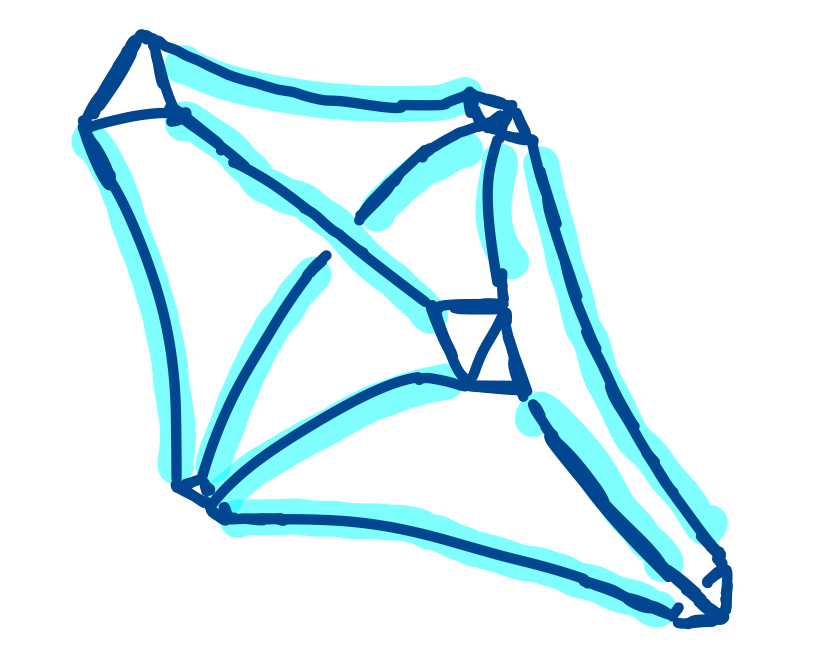

# Geometric Bistellar Flips 
This is a repository of scripts that search through geometric triangulations of cusped hyperbolic 3-manifolds.

- `geometricmoves.py`  contains functions for applying local (2-3 or 3-2) moves to an essential triangulation, updating the geometric shapes and the triangulation.
- `geometricsearch.py` contains various scripts for searching through the geometric, pseudogeometric, and essential subgraphs of the Pachner graph, using geometric 2-3 and 3-2 moves.

+ testing-scripts
- `verifyisolated.py` quickly verifies if an input sig is geometrically isolated. Not dependent on other files here.
- `testmoves.py` contains functions to test geometric moves.

+ recursion-gadget
- `recursiongadget.py` contains scripts for searching for 'recursion gadgets', which are substructures along with a sequence of local moves on the substructure which result in a new geometric triangulation containing the substructure. The existence of one implies the existence of infinitely many geometric triangulations, see https://arxiv.org/abs/1508.04942.